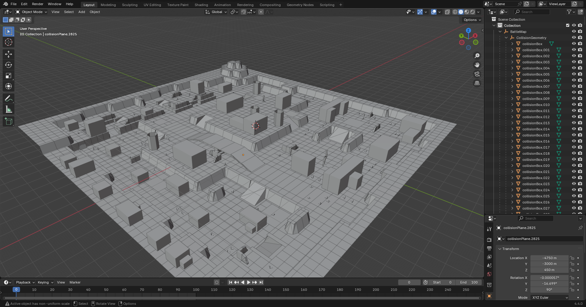

# io_scene_a3d
Blender plugin to import the proprietary model format `A3D` used by the game [Tanki Online](https://tankionline.com/en/) from [Alternativa Games](https://alternativa.games/), it is not compatible with older the formats used by the flash based Alternativa3D engine (see [this plugin by Davide Jones](https://github.com/davidejones/alternativa3d_tools) instead). The plugin can also import Tanki Online binary format maps: `map.bin`, both legacy maps and remaster maps work.

## Installation
### Requirements: Blender version 4.2+
### Optional: io_scene_3ds plugin for importing legacy maps (non remaster)

Firstly download the repository by clicking the "Code" button and then "Download ZIP". 
 

In blender, go to Edit > Preferences and click the "add-ons" button. From there click the arrow on the top right and click "Install from disk". 
 

Select the zip folder you downloaded and you should be good to go.

## Showcase

## Status
### .a3d
The plugin only supports importing models and supports loading the majority of A3D data:
- Materials (color data imported but diffuse map is ignored as it is usually empty or references files that are not available to players)
- Mesh data (vertex positions, normals and UV channels)
- Material indices (each mesh can have multiple materials applied to it)
- Object data (object hierarchy/parents, object names)
- Transform data (object position, scale, rotation)

The plugin only supports version 2 (map props) and version 3 (tank models) files, version 1 is not implemented because it is not currently used in game and I have never seen one of these files before.
### map.bin
The plugin can load Remaster and Legacy maps, legacy maps have incorrect transforms on some props due to the `.3ds` file plugin, not all data is required to import the files into blender, currently supported data is:
- Static geometry (the visual aspect of the map)
- Collision geometry (the collisions of the map)
- Spawnpoints (where tanks spawn)
The plugin also supports `lightmapdata` files that come with remaster maps, these files provide information about the lighting of the map:
- Sun angle and colour
- Ambient light colour
- Object shadow settings (can the object recieve or cast shadows)
- Lightmap UV coordinates (not imported)
- Lightmaps (not imported)
- Lightprobes (not imported)

## File format
Check the wiki for file format documentation.